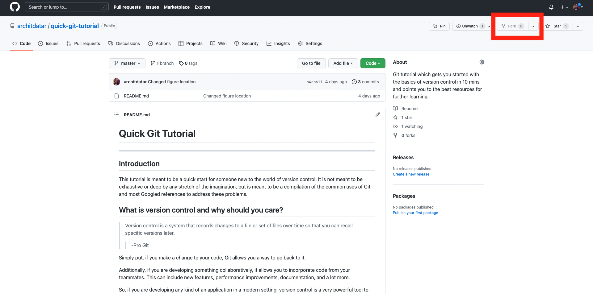
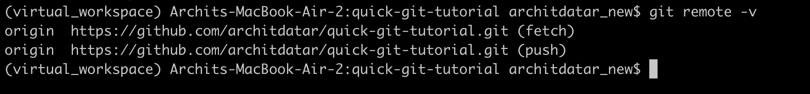

# Part I: Git Installation and Basic Commands

## Coverage
In this tutorial, you will install Git on your system, download (clone) the code for this sample project, make some changes to it, and upload (push) it to the remote repository.  

## Git installation

First, check if you have Git. If you don't, download it. See [here](https://git-scm.com/book/en/v2/Getting-Started-Installing-Git) for more information. 

### Windows
Visit https://git-scm.com/download/win to download the latest version. As part of this installation, be sure to install Git Bash. This will be the CLI tool that you will use. Go ahead and open it after it has been installed.

### Mac
Open the terminal and type:
```
git --version
```
If you get a version, you have Git installed. Else, follow the prompts to download it. 

### Linux
Open the terminal and type:
```
git --version
```
If you get a version, you have Git installed. Else, if you are using Ubuntu or Debian-based distribution, type:
```
sudo apt install git-all
```
For other Linux distributions, use https://git-scm.com/download/linux.


## Basic Git commands

### Get current version of a project
Recall the one of the main aims of using version control is collaborative development. This means that all the collaborators must have access to the project. This is hard to do when the code lives on a personal machine. Thus, in most cases, the code is hosted on a remote server where access can be accessed easily and stay safe.

So, let's say you wanted to contribute a cool feature to someone's code. The first step would be to get their code on your system. 

Here are the steps to do so in a typical project on Github. 
1. Access the link where the repository lives (you are already here, so this step is done.)
2. *Fork* this repo to your own Github account. Why this is necessary will be explained later. The *Fork* button is provided in the top-right corner of the screen as shown below. 



3. Go to your Github account and access the forked version of this repository. This is your remote version of repository (also refered to as *repo*). 


__*Note*__: In this tutorial, you will be using the code from this tutorial which lives on my Github account. Thus, you had to do steps 1-3. If you were starting your own repo, you could simply initialize one by going to your homepage on Github and creating a new repo. 


Once you access this code stored on the remote, clone it to your system. 


First, open the command line interface (CLI) and navigate to the folder where you want the repository to downloaded using: 

```
cd <DESIRED_DIRECTORY>
```

Then, clone the current project using:
```
git clone https://github.com/architdatar/quick-git-tutorial
```

Depending on the settings of the repository, you might be asked to first make an account or your credentials on the site such as GitLab or Github. Do that and repeat this step. You should be able to get the code. Congratulations, you have cloned your first repository. 

### Make some additions and add them to the repository 
Now that you have the code, make some changes to it. In this demonstration, you will contribute an idea for an app (doesn't have to be original, but bonus points if it is). 

Go the *app_ideas* directory, create a new sub directory and give it the name of your app. Under this directory, make a file titled *pseudocode.txt*. A "pseudocode" is like a work flow of how you want the code to run. See the file *navigation/pseudocode.txt* for example. This is your idea for an app and how you would want it to work. 

Once you have done this, you should want to push these back to the remote repository so that it will live on the remote server and be accessed by others. This is what you will do now. 

The following figure shows the keys steps which will be discussed below. 

|  |
| :--: |
| *Image used from [Mark Lodato](https://marklodato.github.io/visual-git-guide/index-en.html)* |

#### Stage
Loosely speaking, when you pulled the repo, the folder that got formed is called the working directory. This contains the changes that you are currently working on. 

Now, we want to *commit* these changes to the history of the development of this project so that they can be retrieved later. 

In order to do this, we must first *stage* these files; i.e., prepare them for being committed. (I am skipping a lot of details here but i have provided references). 

At this point, you might be wondering why it is necessary to *stage* the changes as opposed to committing them directly. This is because sometimes there are certain changes we want to add to one commit and others that we want to add to a different commit. And staging allows us to do this. You can read more about this on this Stackoverflow [thread](https://stackoverflow.com/questions/4878358/why-would-i-want-stage-before-committing-in-git) but if you are a beginner, you can skip it for now. 

To stage all the changes in the working directory, type:
```
git add "*"
```

To stage particular files, type:
```
git add <FILENAME>
```

For this tutorial, please type the former. You can check the status of your changes by typing: 
```
git status
```

#### Commit
Now, we will commit these so that they can be reverted to. 
```
git commit -m "YOUR COMMIT MESSAGE"
```
Check if the commit has been successful using:
```
git log
```
This shows you a list of the all the commits on the branch. Make sure that you see your commit in the Git logs. 

#### Push
Now, we will push your changes now to the remote (i.e, Github).

Note that in this case, we use the default remote. Be sure to check the remote using:
```
git remote -v
```
This will show you the information of the remote that the repo is pointing to. 

For instance, it shows the following for me: 



Once you ensure that this is correct, type: 
```
git push
```

Depending on the remote, you might be asked for your credentials. Enter those. Visit your remote repo and refresh the page. You should see your changes updated there. 


## Conclusions and key learnings
Congratulations! You have finished the basic steps to pull from and push to code to remote repositories. Visit the remote URL to verify that your changes are showing in the remote. You have now learned how to get code from and contribute code to your own remote respositories. 
